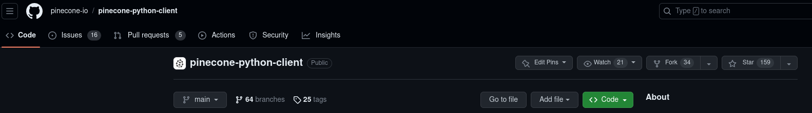

# Contributing

## Installing development versions

If you want to explore a potential code change, investigate a bug, or just want to try unreleased features, you can also install specific git shas.

Some example commands:

```shell
pip3 install git+https://git@github.com/pinecone-io/pinecone-python-client.git
pip3 install git+https://git@github.com/pinecone-io/pinecone-python-client.git@example-branch-name
pip3 install git+https://git@github.com/pinecone-io/pinecone-python-client.git@44fc7ed

poetry add git+https://github.com/pinecone-io/pinecone-python-client.git@44fc7ed
```

## Developing locally with Poetry

[Poetry](https://python-poetry.org/) is a tool that combines [virtualenv](https://virtualenv.pypa.io/en/latest/) usage with dependency management, to provide a consistent experience for project maintainers and contributors who need to develop the pinecone-python-client as a library.

### Step 1. Fork the Pinecone python client repository

On the [GitHub repository page](https://github.com/pinecone-io/pinecone-python-client) page, click the fork button at the top of the screen and create a personal fork of the repository:



It will take a few seconds for your fork to be ready. When it's ready, **clone your fork** of the Pinecone python client repository to your machine.

Change directory into the repository, as we'll be setting up a virtualenv from within the root of the repository.

### Step 2. Install Poetry

Visit [the Poetry site](https://python-poetry.org/) for installation instructions.

### Step 3. Install dependencies

Run `poetry install -E grpc -E asyncio` from the root of the project.

### Step 4. Enable pre-commit hooks.

Run `poetry run pre-commit install` to enable checks to run when you commit so you don't have to find out during your CI run that minor lint issues need to be addressed.

## Common tasks

### Debugging

See the [debugging guide](./docs/maintainers/debugging.md). If you find an issue and would like to report it as a github issue, make sure you do not leak your API key that may be included in debug outputs.

### Running tests

- Unit tests: `make test-unit`
- Run the tests in a single file: `poetry run pytest tests/unit/data/test_bulk_import.py`

For more information on testing, see the [Testing guide](./docs/maintainers/testing-guide.md). External contributors should not worry about running integration tests as they make live calls to Pinecone and will incur significant costs.

### Running the type checker

If you are adding new code, you should make an effort to annotate it with [type hints](https://mypy.readthedocs.io/en/stable/cheat_sheet_py3.html).

You can run the type-checker to check for issues with:

```sh
poetry run mypy pinecone
```

### Running the ruff linter / formatter

These should automatically trigger if you have enabled pre-commit hooks with `poetry run pre-commit install`. But in case you want to trigger these yourself, you can run them like this:

```
poetry run ruff check --fix # lint rules
poetry run ruff format      # formatting
```

If you experience any issues please [file a new issue](https://github.com/pinecone-io/pinecone-python-client/issues/new).

### Submitting a Pull Request

Once you have a change in your fork you feel good about, confirm you are able to run unit tests, pass the ruff and mypy type-checking steps, please submit a [Pull Request](https://github.com/pinecone-io/pinecone-python-client/compare). All code contributed to the pinecone-python-client repository is licensed under the [Apache 2.0 license](./LICENSE.txt).
