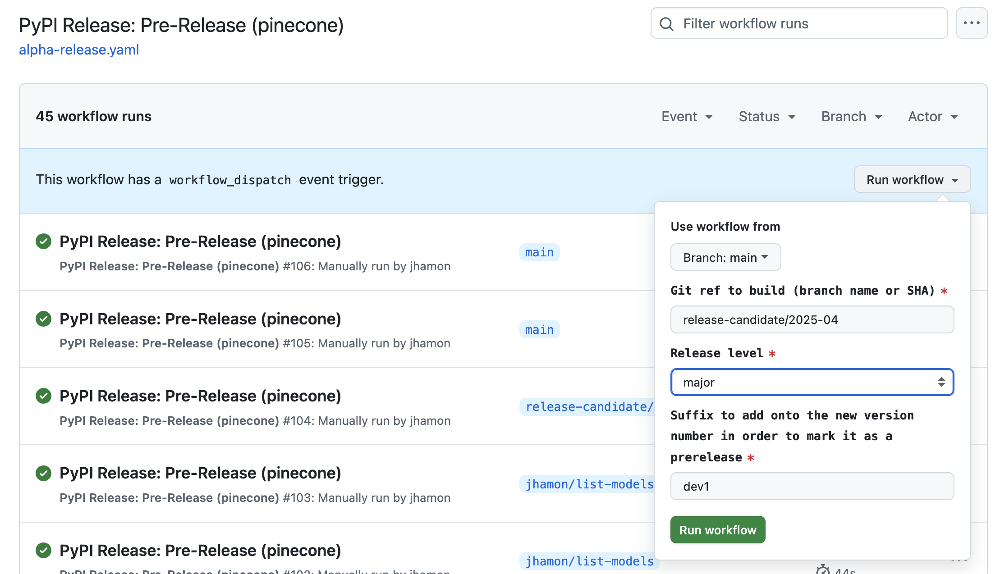

# Releasing the Pinecone SDK

The Pinecone SDK is published to PyPI as `pinecone`.

The release process is mostly automated in a pair of git workflows that are triggered using the "Run workflow" button in the Github UI.

## Dev Builds / Release Candidates

For these, you will use the [PyPI Release: Pre-Release (pinecone)](https://github.com/pinecone-io/pinecone-python-client/actions/workflows/alpha-release.yaml) github workflow.

This workflow:
- Increments the version number based on your selelction in the dropdown menu
- Build and uploads the release to PyPI

Notably, the version number change is not committed or tagged and tests are not run.

## Releasing

For "real" releases (i.e. those without a `.rc` or `.dev` suffix applied to the release number), we use the [PyPI Release: Production (pinecone)](https://github.com/pinecone-io/pinecone-python-client/actions/workflows/release.yaml) workflow.

Prior to running the release workflow, you should ensure:
- If this is a major release, you should have merged work in your release-candidate branch into main
- The last test run on main was green
- There are no unmerged PRs you expected to include in the release
- You have prepared some draft release notes so you can publish them right away once the artifact is available on PyPI
- Other stakeholders (docs, marketing, etc) are ready for a new release to go out.

This workflow:
- Executes all tests
- Increments the version number based on your selection in the dropdown menu
- Commits the version number change
- Tags the commit with a git tag for the version number.
- Builds and uploads the release to PyPI
- Git pushes the commit and tags to `main` so they are persisted.

Once the release is out, you need to [publish release notes](https://github.com/pinecone-io/pinecone-python-client/releases/tag/v7.0.0)

Publishing these release notes will result in a notification being published to the internal Slack. This is what lets other stakeholders (docs, devrel, field engineering, etc) know a new release is available.

## Yanking a bad release

If you ship something that is later discovered to have some sort of catastrophic issue, it is possible to yank a bad release from PyPI. For this, find our PyPI credentials in the engineering vault on 1Password.
